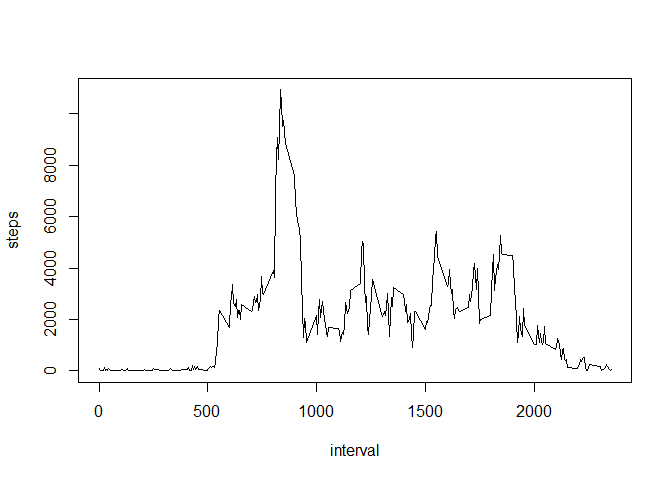

# Reproducible Research: Peer Assessment 1

if the file 'activity.zip' is included in the same directory than the R markdown
file it could be processed. This file is part of the repository, please clone
the entire repository before processing the R markdown file rather than downdoad
the R markdown file directly.

IS THE 'activity.zip' FILE PRESSENT? **TRUE**.

## Loading and preprocessing the data

In this step we load the data and create a secondary data frame with the
complete cases only.


```r
unzip('activity.zip', exdir='data')

data  <- read.csv('data/activity.csv', colClasses=c('numeric', 'Date', 'numeric'))
cdata <- data[complete.cases(data),]
```

## What is mean total number of steps taken per day?

- Calculate the total number of steps taken per day


```r
agg_sum <- aggregate(cdata$steps, list(cdata$date), sum)
```

- If you do not understand the difference between a histogram and a barplot,
research the difference between them. Make a histogram of the total number of
steps taken each day


```r
hist(agg_sum$x, main='Steps per day', xlab='steps')
```

 

- Calculate and report the mean and median of the total number of steps taken
per day


```r
steps_mean   <- mean  (agg_sum$x)
steps_median <- median(agg_sum$x)
```

The mean of the number of steps on each day is: 1.0766189\times 10^{4}
The median of the number of steps on each day is: 1.0765\times 10^{4}

## What is the average daily activity pattern?

- Make a time series plot (i.e. type = "l") of the 5-minute interval (x-axis)
and the average number of steps taken, averaged across all days (y-axis)


```r
agg_sum_by_interval <- aggregate(cdata$steps, list(cdata$interval), sum)
plot(agg_sum_by_interval$Group.1, agg_sum_by_interval$x, type='l', ylab='steps', xlab='interval')
```

 

Which 5-minute interval, on average across all the days in the dataset, contains the maximum number of steps?


```r
max_interval <- agg_sum_by_interval[agg_sum_by_interval$Group.1==max(agg_sum_by_interval$x),'Group.1']
```

The mean of the number of steps on each day is: 

## Imputing missing values

- Calculate and report the total number of missing values in the dataset (i.e.
the total number of rows with NAs)


```r
na_count <- nrow(data) - nrow(cdata)
```

The number of NAs in the original data set: 2304

- Devise a strategy for filling in all of the missing values in the dataset. The
strategy does not need to be sophisticated. For example, you could use the
mean/median for that day, or the mean for that 5-minute interval, etc.

- Create a new dataset that is equal to the original dataset but with the
missing data filled in.


```r
fdata <- data.frame(data)
fill <- aggregate(cdata$steps, list(cdata$interval), mean)

for (x in which(!complete.cases(fdata))) {
  fdata[x, 'steps'] <- fill[fill$Group.1==fdata[x, 'interval'], 'x']
}
```

- Make a histogram of the total number of steps taken each day and Calculate and
report the mean and median total number of steps taken per day. Do these values
differ from the estimates from the first part of the assignment? What is the
impact of imputing missing data on the estimates of the total daily number of
steps?


```r
fagg_sum <- aggregate(fdata$steps, list(fdata$date), sum)
hist(fagg_sum$x, main='Steps per day', xlab='steps')
```

 


```r
fsteps_mean   <- mean(fagg_sum$x)
fsteps_median <- median(fagg_sum$x)
```

The mean of the number of steps on each day is: 1.0766189\times 10^{4}
The median of the number of steps on each day is: 1.0766189\times 10^{4}

The impact of the filling values is almos none.

## Are there differences in activity patterns between weekdays and weekends?

- Create a new factor variable in the dataset with two levels - "weekday" and
"weekend" indicating whether a given date is a weekday or weekend day.


```r
wdwe <- function(x) {
  if (x==0 || x==6)
    return('weekend')
  else
    return('weekday')
}

fdata[,'day_type'] <- factor(sapply(as.POSIXlt(fdata$date)$wday, wdwe))
```


- Make a panel plot containing a time series plot (i.e. type = "l") of the
5-minute interval (x-axis) and the average number of steps taken, averaged
across all weekday days or weekend days (y-axis). See the README file in the
GitHub repository to see an example of what this plot should look like using
simulated data.


```r
library(lattice)
fagg_mean <- aggregate(fdata$steps, list(fdata$day_type, fdata$interval), sum)
xyplot(x ~ Group.2 | Group.1, fagg_mean, type='l', ylab='steps', xlab='interval', layout=1:2)
```

 
